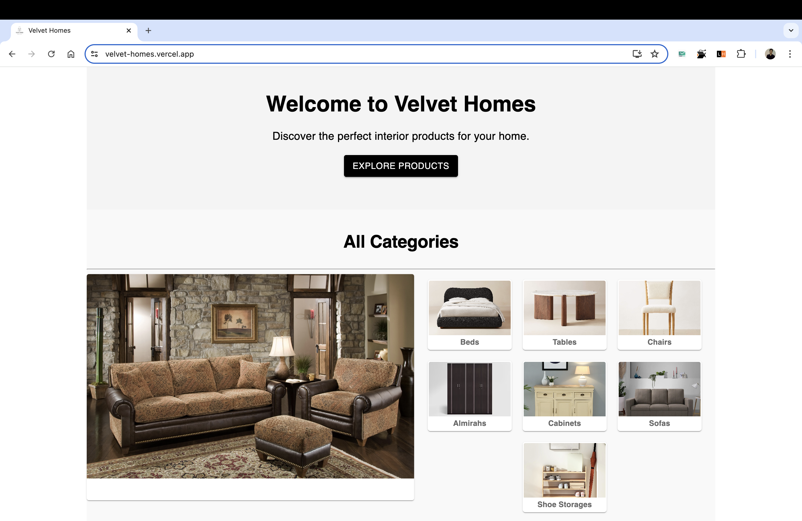
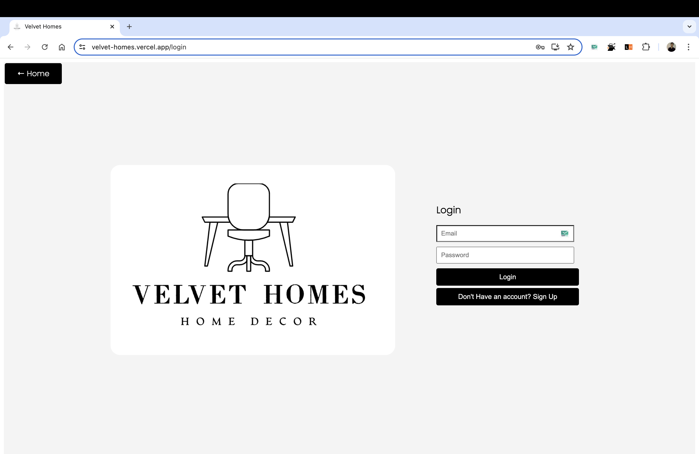
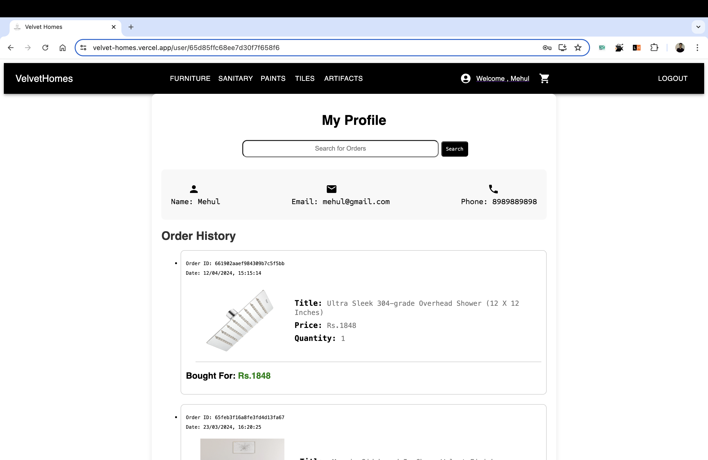
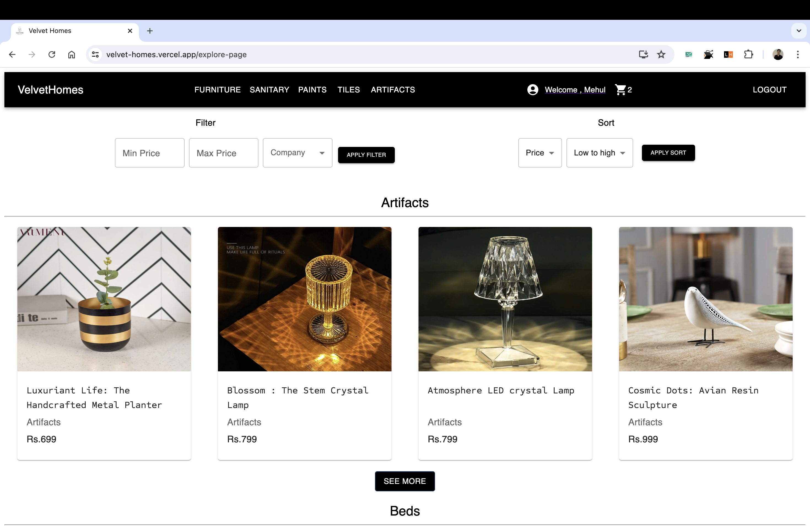
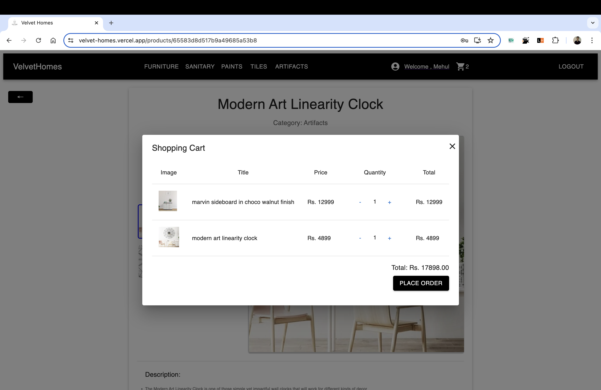

# VelvetHomes

## Overview

VelvetHomes is a modern e-commerce platform designed to provide users with an intuitive and seamless home interior products browsing experience. This project leverages the latest web technologies to deliver a fast and responsive interface for both buyers and sellers. It is a one-stop solution for home interiors using the MERN Stack: MongoDB, Express.js, React, and Node.js.

## Features

- **User Authentication:** Secure login and registration functionality.
- **Property Listings:** Detailed property descriptions, images, and pricing.
- **Search and Filter:** Advanced search and filtering options to find the perfect home.
- **Responsive Design:** Optimized for desktop and mobile devices.

## Images

## Technologies Used

- **Frontend:**
  - React.js
  - Redux
  - CSS3
  - HTML5

- **Backend:**
  - Node.js
  - Express.js
  - MongoDB

## Getting Started

### Prerequisites

Make sure you have the following installed:

- Node.js
- MongoDB

## Project Highlights

- **Integration:** Orchestrated integration of over 5 distinct domains including user authentication, product management, and payment processing.
- **E-commerce Solution:** Engineered an end-to-end e-commerce solution with dynamic address management and seamless checkout functionality.
- **Purchase Process:** Spearheaded the development of a multi-step purchase process, streamlining user experience and enhancing conversion rates.
- **State Management:** Leveraged context API for centralized state management, ensuring scalability and maintainability of the application architecture.

